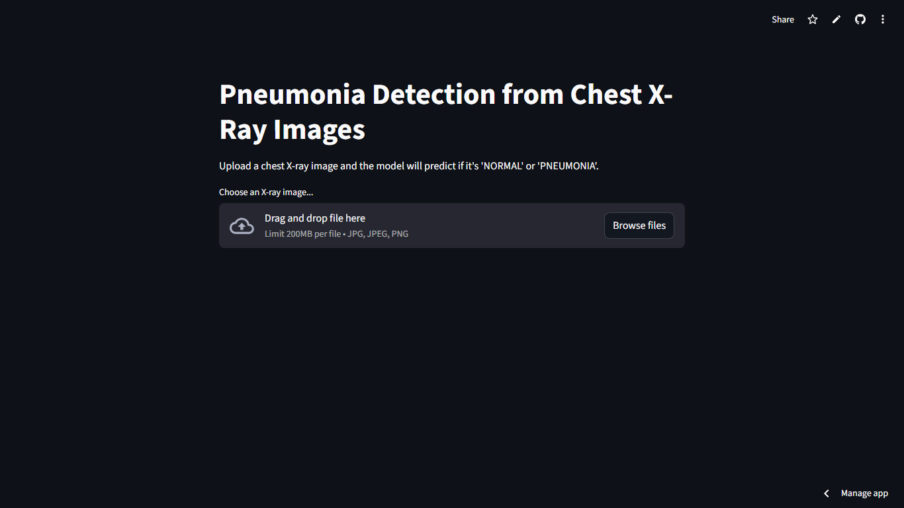

 # 🫁 Pneumonia Detector AI

A deep learning web app built with TensorFlow and Streamlit that classifies chest X-ray images as "Normal" or "Pneumonia."

This project was built as an end-to-end portfolio piece, covering every stage from data exploration and model training to building a user-facing web application and deploying it to the cloud.

---

## 🚀 Live App

**You can try the live app here:** [https://pneumonia-detector-app-cdatbuuxairyfkyufjymbd.streamlit.app/]

---

## 📷 App Preview




---

## 🛠️ Tech Stack

* **Model:** TensorFlow / Keras (using Transfer Learning with MobileNetV2)
* **Web App:** Streamlit
* **Data Science:** NumPy & Pillow (PIL)
* **Deployment:** Streamlit Community Cloud
* **Version Control:** Git & GitHub (with Git LFS for model file)

---

## 📋 Project Highlights

* **Model Performance:** The final model achieved **~95% Recall** and **~83% Precision** on the unseen test set, demonstrating a strong ability to correctly identify positive pneumonia cases (which is the most critical metric for this problem).
* **Data Imbalance:** Correctly identified and handled a 3:1 class imbalance in the dataset, focusing on Precision and Recall over simple Accuracy.
* **Deployment:** Successfully deployed as a public, interactive web application.
* **End-to-End:** Demonstrates the full ML lifecycle, from a Jupyter Notebook (`explore_data.ipynb`) for analysis to a production-ready script (`app.py`).

---

## 🏁 How to Run Locally

1.  **Clone the repository:**
    ```bash
    git clone [https://github.com/leo0042/pneumonia-detector-app.git]
    cd pneumonia-detector-app
    ```

2.  **Install Git LFS** to pull the model file:
    ```bash
    git lfs install
    git lfs pull
    ```

3.  **Create and activate a virtual environment:**
    ```bash
    python -m venv venv
    source venv/bin/activate  # On Windows: venv\Scripts\activate
    ```

4.  **Install the required libraries:**
    ```bash
    pip install -r requirements.txt
    ```

5.  **Run the Streamlit app:**
    ```bash
    streamlit run app.py
    ```
